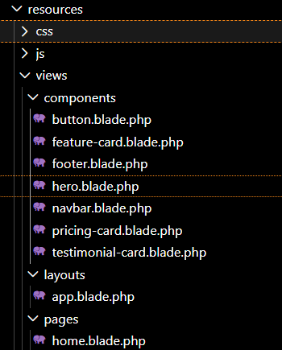
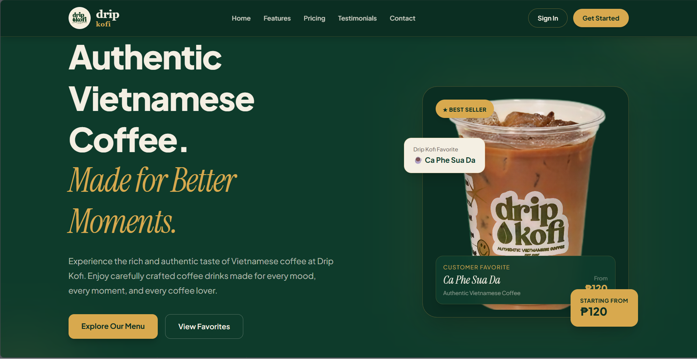
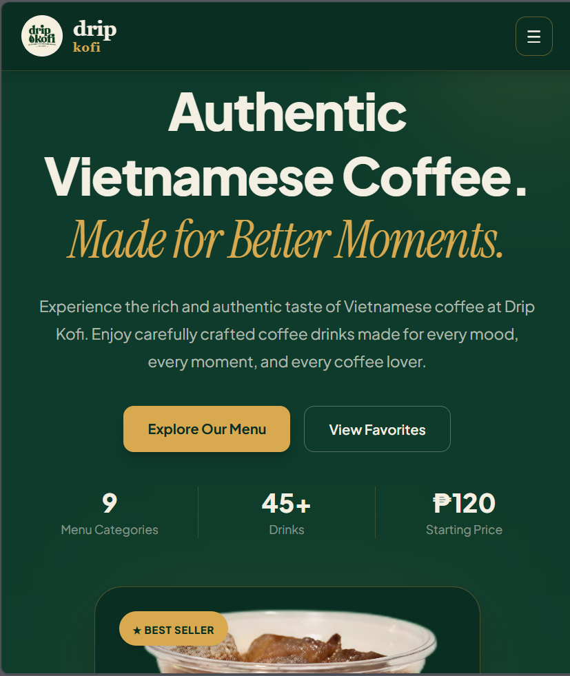
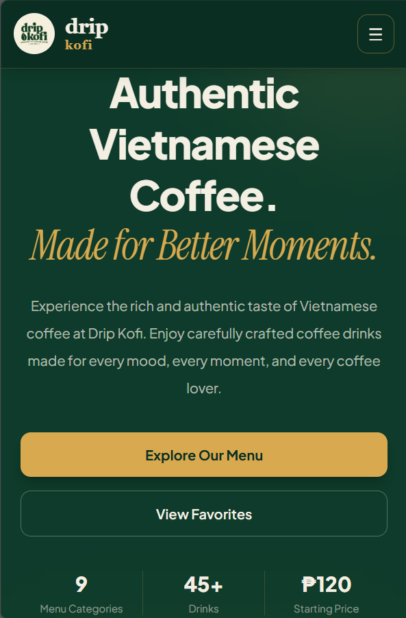
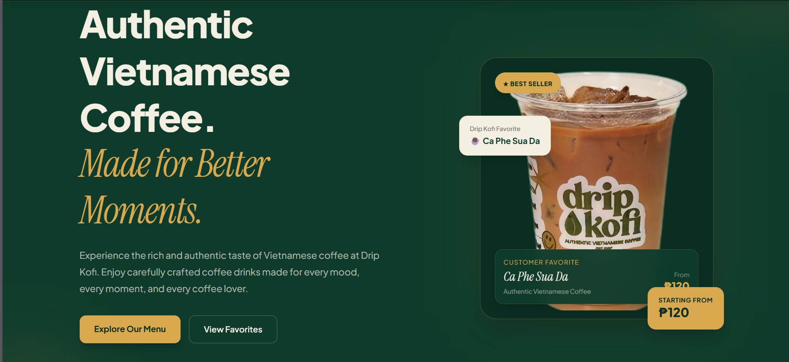
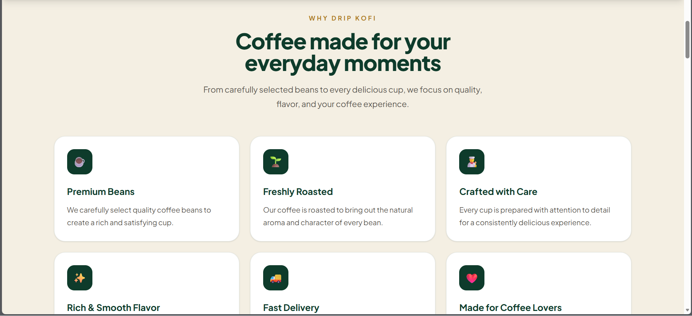
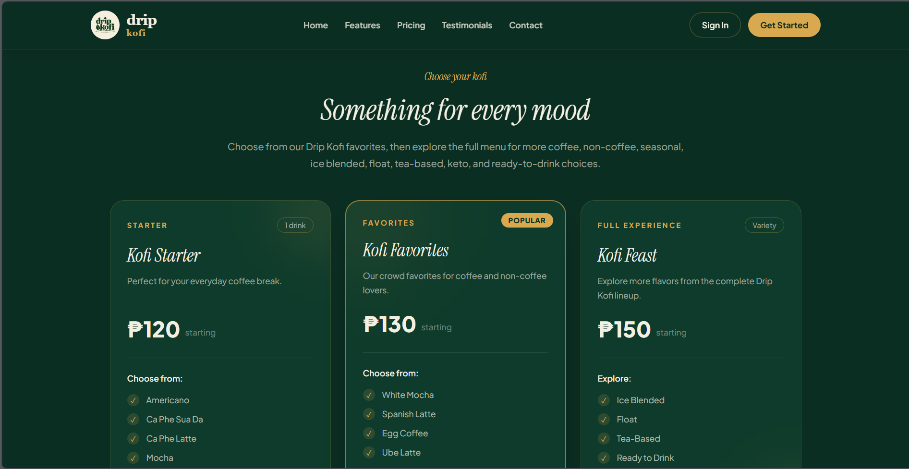
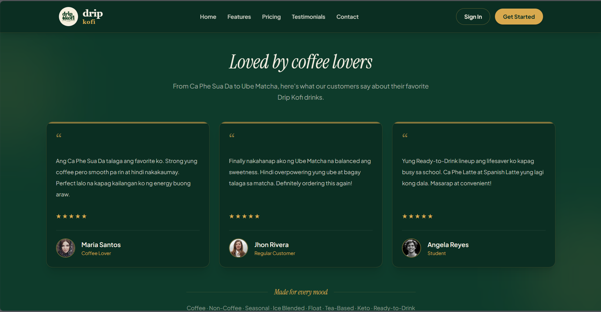
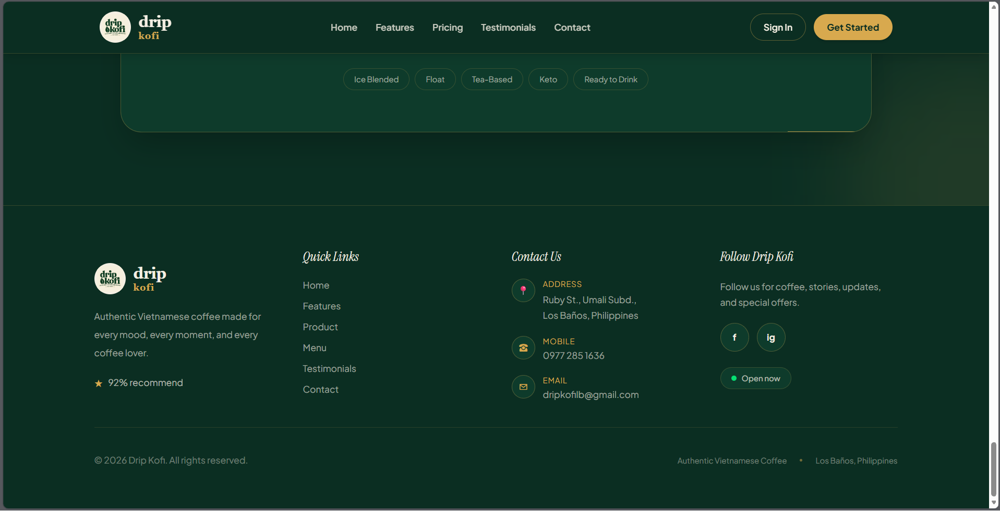
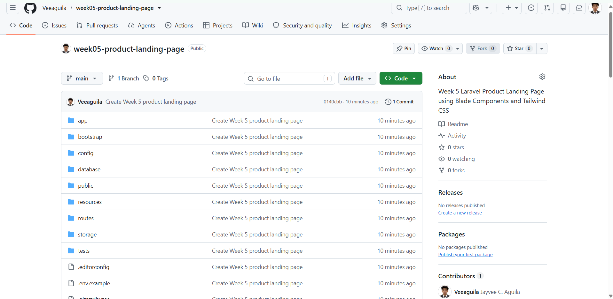

<p align="center">
  
  
  
  
</p>

<p align="center">
  <strong>Authentic Vietnamese Coffee. Made for Better Moments.</strong>
</p>

<p align="center">
  A responsive product landing page for Drip Kofi, showcasing authentic Vietnamese coffee, drinks, features, pricing, testimonials, and contact information.
</p>

---

## 1. Project Title

# Drip Kofi - Product Landing Page

Drip Kofi is a coffee shop product landing page designed to promote and showcase the brand's products and services through a modern, responsive, and user-friendly website.

The landing page focuses on Drip Kofi's authentic Vietnamese coffee and different beverage selections, including coffee, non-coffee drinks, ice-blended drinks, floats, tea-based drinks, keto options, and ready-to-drink beverages.

---

## 2. Introduction

### What is a Product Landing Page?

A Product Landing Page is a focused webpage created to introduce, promote, and showcase a specific product, service, or business.

A landing page normally presents important information in one organized location, such as:

- Product information
- Features
- Product images
- Pricing
- Customer testimonials
- Call-to-action buttons
- Contact information

For this project, the landing page was created for **Drip Kofi**, a coffee shop offering authentic Vietnamese coffee and a variety of beverages.

### Why Landing Pages are Important for Businesses

Landing pages are important for businesses because they provide customers with a clear and attractive way to discover products and services.

A well-designed landing page can:

- Create a strong first impression.
- Introduce a company's brand.
- Showcase products and services.
- Highlight important product features.
- Display prices and offers.
- Build customer trust through testimonials.
- Encourage visitors to take action.
- Provide important contact information.
- Improve the overall customer experience.

### Purpose of the Project

The purpose of this project is to develop a responsive product landing page for Drip Kofi using **Laravel Blade and Tailwind CSS**.

The project demonstrates how a modern web interface can be designed using responsive layouts, reusable components, product cards, pricing cards, testimonials, and call-to-action sections.

The landing page promotes Drip Kofi as a destination for **authentic Vietnamese coffee** while providing visitors with an easy way to explore the menu and learn more about the business.

---

## 3. Objectives

The objectives accomplished during this activity include:

- Create a complete product landing page.
- Understand the structure of a modern landing page.
- Build a responsive website.
- Apply mobile-first design principles.
- Use Tailwind CSS for website styling.
- Use Flexbox for element alignment.
- Use CSS Grid for responsive layouts.
- Create reusable Blade Components.
- Design a responsive navigation bar.
- Create a Hero Section.
- Create a Features Section.
- Create a Product Showcase.
- Create a Pricing Section.
- Create a Testimonials Section.
- Create a Call-to-Action Section.
- Create a Footer.
- Use actual product images.
- Apply a consistent color palette and typography.
- Improve user experience through responsive design.
- Organize the project using proper folders.
- Use Git for version control.
- Upload and manage the project using GitHub.

---

## 4. Responsive Web Design

Responsive Web Design is the process of creating websites that automatically adapt to different screen sizes and devices.

The Drip Kofi landing page was designed to work properly on:

- Desktop computers
- Laptops
- Tablets
- Mobile phones

### Mobile-First Design

Mobile-first design means designing the website starting with smaller screens and then adapting the layout for larger screens.

Tailwind CSS makes mobile-first development easier because responsive classes can be added directly to HTML elements.

Example from the project:

```html
<div class="grid gap-5 sm:grid-cols-2 lg:grid-cols-4">
```

The `sm:grid-cols-2` class changes the layout to two columns on small screens, while `lg:grid-cols-4` displays four columns on large screens.

### Responsive Breakpoints

Tailwind CSS provides responsive breakpoints that allow elements to change their layout depending on the screen size.

The project uses breakpoints such as:

- `sm:` – Small screens
- `md:` – Medium screens
- `lg:` – Large screens
- `xl:` – Extra-large screens

Example:

```html
<div class="grid gap-5 sm:grid-cols-2 lg:grid-cols-4">
```

This allows the menu items to automatically adjust depending on the device.

### Flexbox

Flexbox is used to arrange and align elements horizontally or vertically.

Example from the navigation and buttons:

```html
<div class="flex flex-col gap-4 sm:flex-row">
```

On mobile devices, the elements are displayed vertically. On larger screens, they are displayed horizontally.

### CSS Grid

CSS Grid is used for sections that contain multiple cards or content blocks.

Example:

```html
<div class="grid gap-5 sm:grid-cols-2 lg:grid-cols-4">
```

This is used in the Product Showcase to organize the featured Drip Kofi drinks.

### User Experience (UX)

User Experience focuses on making the website easy, clear, attractive, and comfortable to use.

The Drip Kofi landing page improves UX by providing:

- Clear navigation
- Easy-to-read typography
- Consistent spacing
- Responsive layouts
- Clearly visible buttons
- Product images
- Organized menu categories
- Pricing information
- Customer testimonials
- Contact information
- Clear call-to-action sections

### Why Responsive Design Matters

Responsive design is important because users access websites using different devices and screen sizes. A responsive website ensures that the content remains readable and usable whether the visitor is using a desktop, tablet, or mobile phone.

---

## 5. Tailwind CSS

Tailwind CSS is a utility-first CSS framework used to create modern and responsive user interfaces.

The Drip Kofi project uses Tailwind CSS for layout, spacing, typography, colors, borders, shadows, and responsive behavior.

### Utility-First CSS

Utility-first CSS means using small utility classes directly in HTML elements instead of creating large custom CSS files.

Example:

```html
<h1 class="text-5xl font-black text-[#F4EFE3] sm:text-6xl lg:text-7xl">
    Authentic Vietnamese Coffee.
</h1>
```

The classes control:

- `text-5xl` – Font size
- `font-black` – Font weight
- `text-[#F4EFE3]` – Text color
- `sm:text-6xl` – Responsive font size
- `lg:text-7xl` – Large-screen font size

### Advantages of Tailwind CSS

Tailwind CSS provides several advantages:

- Faster UI development
- Responsive design utilities
- Consistent spacing
- Consistent colors
- Easy customization
- Less custom CSS
- Easy component styling
- Mobile-first responsive development

### Responsive Utility Classes

Responsive utility classes allow styles to change at different screen sizes.

Example:

```html
<div class="grid grid-cols-1 gap-5 sm:grid-cols-2 lg:grid-cols-4">
```

The layout changes from:

- 1 column on mobile
- 2 columns on small/medium screens
- 4 columns on large screens

Another example:

```html
<div class="px-6 py-20 sm:py-28 lg:px-8 lg:py-32">
```

The padding changes based on the screen size.

### Component Styling

Tailwind CSS is also used to style reusable UI components such as cards, buttons, navigation items, and sections.

Example of a Drip Kofi button:

```html
<a
    href="#product"
    class="rounded-xl bg-[#D8A94E] px-7 py-3.5 font-bold text-[#0B2E22] shadow-lg transition duration-300 hover:-translate-y-1 hover:bg-[#E7C56F]"
>
    Explore Our Menu
</a>
```

This creates a button with:

- Rounded corners
- Gold background
- Dark green text
- Padding
- Bold typography
- Shadow
- Hover animation

---

## 6. Blade Components

Blade Components are reusable UI elements in Laravel Blade that allow developers to organize and reuse parts of a webpage.

Instead of writing the same HTML repeatedly, a component can be created once and reused in multiple sections or pages.

Examples of reusable components in a landing page include:

- Navigation Bar
- Buttons
- Product Cards
- Feature Cards
- Pricing Cards
- Testimonial Cards
- Footer
- Section headings

### Why Reusable Components Improve Maintainability

Reusable components make the project easier to maintain because changes can be made in one place.

For example, if the design of a button needs to be changed, the button component can be updated instead of manually changing every button throughout the website.

This helps reduce:

- Repeated code
- Development time
- Styling inconsistencies
- Maintenance problems

### Benefits of Modular UI Development

Modular UI development separates the interface into smaller reusable sections.

Benefits include:

- Better code organization
- Easier maintenance
- Reusable designs
- Cleaner Blade files
- Consistent UI
- Easier debugging
- Faster development

### Blade Component Example

Example component:

```php
<!-- resources/views/components/button.blade.php -->

<a
    {{ $attributes->merge([
        'class' => 'rounded-xl bg-[#D8A94E] px-7 py-3.5 font-bold text-[#0B2E22] transition hover:bg-[#E7C56F]'
    ]) }}
>
    {{ $slot }}
</a>
```

The component can then be reused:

```html
<x-button href="#product">
    Explore Our Menu
</x-button>
```

Another example of a product card component:

```php
<!-- resources/views/components/product-card.blade.php -->

<div class="group rounded-2xl border border-[#F4EFE3]/10 bg-[#0E3B2B] p-5 text-center">

    

    <h3 class="mt-4 font-bold text-[#F4EFE3]">
        {{ $name }}
    </h3>

    <p class="mt-1 text-xs text-[#F4EFE3]/45">
        {{ $price }}
    </p>

</div>
```

This allows different Drip Kofi products to use the same card design.

### Blade Components Screenshot

The project structure contains reusable Blade components inside:

```
resources/views/components
```



---

## 7. User Interface Design

The Drip Kofi landing page uses a consistent visual design inspired by coffee shops and Vietnamese coffee culture.

### Color Palette

| Color | Purpose |
|---|---|
| `#0E3B2B` | Main dark green background |
| `#0B2E22` | Secondary dark green |
| `#D8A94E` | Gold accent color |
| `#E7C56F` | Button hover color |
| `#F4EFE3` | Cream/light text |
| `#4A2E1E` | Coffee brown |

The dark green color creates a premium coffee-shop atmosphere, while the gold accent provides contrast and highlights important elements.

### Typography

The project uses bold typography for headings and readable text for descriptions.

Example:

```html
<h1 class="text-5xl font-black sm:text-6xl lg:text-7xl">
    Authentic Vietnamese Coffee.
</h1>
```

The project also uses an italic serif style for selected branding and decorative text:

```html
<span class="font-['Instrument_Serif'] italic">
    Made for Better Moments.
</span>
```

### Iconography

Icons and visual symbols are used to quickly communicate information.

Examples include:

- ☕ Coffee
- 🥛 Non-Coffee
- 🧊 Ice Blended
- 🍦 Float
- 🍵 Tea-Based
- 🌿 Keto
- 🧋 Ready to Drink
- ➕ Add-ons

Product images are also used to visually represent featured drinks such as:

- Ca Phe Sua Da
- White Mocha
- Ube Matcha
- Coco Kofi

### Button Styles

Buttons use the Drip Kofi gold accent color.

Example:

```html
<a
    href="#product"
    class="rounded-xl bg-[#D8A94E] px-7 py-3.5 font-bold text-[#0B2E22] transition hover:bg-[#E7C56F]"
>
    Explore Our Menu
</a>
```

Buttons have rounded corners, strong contrast, and hover effects to make them easy to recognize and interact with.

### Card Design

Cards are used for:

- Features
- Products
- Pricing plans
- Testimonials
- Menu categories

Example:

```html
<div class="rounded-2xl border border-[#D8A94E]/20 bg-[#0E3B2B] p-5">
```

Cards use consistent:

- Border radius
- Padding
- Background colors
- Borders
- Spacing
- Typography

### Layout Consistency

The same visual system is used throughout the entire landing page.

The sections maintain consistent:

- Spacing
- Colors
- Typography
- Button styles
- Card styles
- Alignment
- Responsive behavior

This consistency makes the website easier to understand and provides a better overall user experience.

---

## 8. Folder Structure

The project follows a structured Laravel directory organization.

```
drip-kofi/
│
├── app/
│   └── View/
│
├── public/
│   └── images/
│       ├── Caphesuada.png
│       ├── white-mocha.png
│       ├── ube-matcha.png
│       └── coco-kofi.png
│
├── resources/
│   └── views/
│       ├── layouts/
│       │
│       ├── components/
│       │
│       └── pages/
│
├── screenshots/
│   ├── desktop-view.png
│   ├── tablet-view.png
│   ├── mobile-view.png
│   ├── navigation-bar.png
│   ├── hero-section.png
│   ├── features-section.png
│   ├── pricing-section.png
│   ├── testimonials.png
│   ├── footer.png
│   ├── blade-components-folder.png
│   └── github-repository.png
│
├── documentation/
│
├── routes/
│   └── web.php
│
├── .env
├── composer.json
├── package.json
└── README.md
```

### `resources/views/layouts`

Contains the main Blade layout files used by the application.

Layouts can contain common elements such as:

- HTML structure
- Navigation
- Footer
- CSS references
- JavaScript references

### `resources/views/components`

Contains reusable Blade Components.

Examples include:

- Buttons
- Cards
- Navigation elements
- Product cards
- Feature cards
- Pricing cards
- Testimonials

### `resources/views/pages`

Contains the main webpage views.

For this project, the landing page can be organized inside this directory.

### `public`

Contains publicly accessible assets such as:

- Product images
- Logos
- Icons
- Other static files

Example:

```
public/images/Caphesuada.png
public/images/white-mocha.png
public/images/ube-matcha.png
public/images/coco-kofi.png
```

### `screenshots`

Contains screenshots used to document the project.

These screenshots demonstrate the responsive design and different sections of the landing page.

### `documentation`

Contains additional project documentation and supporting files related to the activity.

---

## 9. Screenshots

The following screenshots document the completed Drip Kofi Product Landing Page.

### Desktop View

The desktop screenshot shows the complete landing page displayed on a large screen.



### Tablet View

The tablet screenshot demonstrates how the layout adapts to a medium-sized screen.



### Mobile View

The mobile screenshot demonstrates the mobile-first responsive layout.



### Navigation Bar

The navigation bar provides users with quick access to the main sections of the website.


### Hero Section

The Hero Section introduces Drip Kofi and highlights its authentic Vietnamese coffee experience.



### Features Section

The Features Section highlights the main qualities and advantages of Drip Kofi.



### Product Showcase

The Product Showcase presents featured Drip Kofi beverages, including:

- Ca Phe Sua Da
- White Mocha
- Ube Matcha
- Coco Kofi

### Pricing Section

The Pricing Section presents the available plans and their included features.



### Testimonials

The Testimonials Section displays customer feedback and reviews to help build trust with visitors.



### Call-to-Action Section

The Call-to-Action section encourages visitors to take action, such as exploring the menu, registering, contacting the business, or starting an order.

### Footer

The Footer contains the business information, quick links, social media links, contact information, and copyright information.



### Drip Kofi Contact Information

The landing page is based on the provided Drip Kofi business information:

- **Address:** Ruby St., Umali Subd., Los Baños, Philippines
- **Mobile:** 0977 285 1636
- **Email:** dripkofilb@gmail.com
- **Instagram:** dripkofi.lb

### Blade Components Folder

This screenshot shows the reusable Blade Components used to organize the project's UI.


### GitHub Repository

This screenshot shows the project's GitHub repository and demonstrates the use of Git and GitHub for version control.



> 📌 Ensure the following image files exist inside a `screenshots/` folder at the root of the repository so they render correctly on GitHub:
> `desktop-view.png`, `tablet-view.png`, `mobile-view.png`, `navigation-bar.png`, `hero-section.png`, `features-section.png`, `pricing-section.png`, `testimonials.png`, `footer.png`, `blade-components-folder.png`, `github-repository.png`

---

## Project Summary

Drip Kofi Product Landing Page demonstrates the use of Laravel Blade and Tailwind CSS to create a modern and responsive coffee shop website.

The project combines responsive web design, reusable Blade Components, Tailwind CSS utility classes, product showcases, pricing, testimonials, call-to-action sections, and business contact information.

The main goal of the project is to provide a clean and attractive online presentation for Drip Kofi's authentic Vietnamese coffee and beverage selections while applying modern web development practices.

### Technologies Used

- Laravel
- PHP
- Blade Templates
- Tailwind CSS
- HTML5
- CSS3
- JavaScript
- Git
- GitHub

### Author

**Jayvee C. Aguila**

---

<p align="center">Drip Kofi Product Landing Page</p>